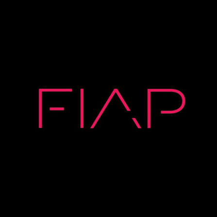
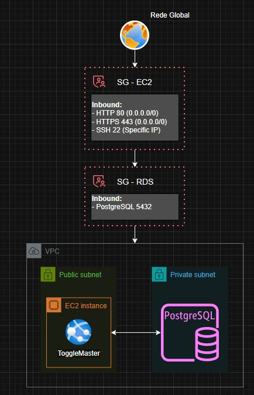

   
  <h3>Tech Challenge - Fase 1</h3>

 

# ToggleMaster — Tech Challenge (Fase 1) | Pós-Tech DevOps

  
  
  
  
  

[Desafio](https://github.com/viniciuschiarelo/FIAP-DevOps-Fase-01/blob/main/desafio.md)

## Sobre o Projeto

O **ToggleMaster** é uma iniciativa de consultoria interna desenvolvida para a *DevOps Solutions Inc.*, focada na criação de uma plataforma centralizada para gerenciamento de **Feature Flags (Feature Toggles)**. O objetivo principal do sistema é viabilizar o lançamento controlado de novas funcionalidades por parte das equipes de desenvolvimento (permitindo a liberação para usuários específicos ou a desativação ágil em cenários de falhas), mitigando a necessidade de novos deploys na infraestrutura.

Este repositório compreende a **Fase 1** do projeto: a implantação de um **MVP (Minimum Viable Product) monolítico** em ambiente de nuvem AWS, validando o ciclo de vida (criação, leitura, atualização e exclusão) de feature flags por meio de uma API REST simplificada.

---

## Cultura DevOps e Arquitetura de Aplicações

### Análise Arquitetural: O Monolito no MVP
O ToggleMaster foi concebido inicialmente sob uma arquitetura monolítica, centralizando toda a sua estrutura lógica, regras de negócio e persistência em uma única base de código coesa. A aplicação opera como uma unidade funcional indivisível, compartilhando o mesmo banco de dados relacional e demandando uma nova compilação e implantação integral a cada modificação realizada.

*   **Vantagens para o cenário de MVP:** Alta simplicidade no desenvolvimento inicial, agilidade no ciclo de implantação, facilidade de gerenciamento e testes locais rápidos, otimizando o *time-to-market* e acelerando o processo de validação da ideia no mercado.
*   **Desvantagens com a evolução do sistema:** Alto acoplamento de código, elevando o risco de impactos indesejados em funcionalidades correlatas durante a manutenção ou correção de bugs; escalabilidade inflexível, exigindo a replicação de toda a infraestrutura monolítica mesmo se o gargalo de processamento for restrito a um único recurso; menor resiliência global, onde falhas em componentes isolados podem resultar na indisponibilidade total do ecossistema.

### Avaliação da Metodologia 12-Factor App
A maturidade técnica da aplicação foi avaliada com base nas diretrizes estabelecidas pelos princípios do *12-Factor App*, identificando os pontos de conformidade e as oportunidades de evolução para ambientes de produção robustos:

| Fator | Status | Análise Técnica e Próximos Passos |
| :--- | :---: | :--- |
| **1. Codebase** | ✅ Atendido | Utilização de uma única base de código rastreada e mapeada via Git. |
| **2. Dependencies** | ✅ Atendido | Declaração explícita de bibliotecas isoladas por meio do arquivo `requirements.txt`. |
| **3. Config** | ✅ Atendido | Configurações de credenciais e acessos externalizadas através de variáveis de ambiente. |
| **4. Backing Services**| ✅ Atendido | O banco de dados PostgreSQL (RDS) é tratado como um recurso anexado e desacoplado. |
| **5. Build, Release, Run**| ⚠️ Pendente | Necessidade de separação estrita e automatizada das etapas do pipeline de deployment. |
| **6. Processes** | ✅ Atendido | Execução em modelo *stateless*, sem retenção de dados ou estados locais no servidor. |
| **7. Port Binding** | ✅ Atendido | Exposição direta do serviço em porta de rede utilizando o servidor HTTP Gunicorn. |
| **8. Concurrency** | ⚠️ Pendente | Otimização da concorrência planejada por meio do ajuste fino de *workers* no Gunicorn. |
| **9. Disposability** | ✅ Atendido | Suporte à inicialização rápida e ao encerramento limpo (*graceful shutdown*). |
| **10. Dev/Prod Parity**| ⚠️ Pendente | Necessidade de estreitar a paridade entre o ambiente de desenvolvimento local e a nuvem AWS. |
| **11. Logs** | ⚠️ Pendente | Transição do modelo de saída padrão para fluxos de logs estruturados e centralizados. |
| **12. Admin Processes**| ✅ Atendido | Execução de processos administrativos (como migrações) de forma isolada do fluxo principal. |

---

## Arquitetura da Infraestrutura (AWS)

Para assegurar o isolamento, a segurança de rede e a estabilidade inicial da API, o desenho da infraestrutura seguiu as práticas recomendadas de topologia de redes na AWS:

*   **VPC (Virtual Private Cloud):** Rede virtual customizada dedicada ao isolamento do ecossistema do projeto.
*   **Sub-redes Públicas:** Hospedagem da instância computacional **Amazon EC2**, viabilizando o roteamento e tráfego de entrada (*inbound*) vindo da internet pública.
*   **Sub-redes Privadas:** Hospedagem da instância de banco de dados gerenciado **Amazon RDS (PostgreSQL)**, garantindo o completo isolamento da camada de persistência contra acessos externos diretos.
*   **Segurança de Rede (Security Groups):**
    *   `SG-EC2`: Configurado para permitir tráfego público de entrada via HTTP (Porta 80) e HTTPS (Porta 443), além de acesso administrativo via SSH (Porta 22) estritamente restrito a um endereço IP específico.
    *   `SG-RDS`: Configurado com regras estritas de firewall para aceitar conexões na porta padrão do PostgreSQL (5432) originadas única e exclusivamente do identificador de segurança da instância (`SG-EC2`).

### Diagrama de Arquitetura

  

---

## AWS Prático: Desafios de Implantação e Soluções

Durante o provisionamento manual e o deploy da aplicação no ambiente de nuvem, foram documentados desafios operacionais superados através das seguintes correções técnicas:

1.  **Sequenciamento de Dependências da Infraestrutura:** Identificou-se inicialmente o provisionamento incorreto da instância EC2 antes da estruturação final da VPC corporativa. A ação corretiva consistiu na destruição do recurso computacional e sua posterior recriação dentro das sub-redes públicas vinculadas à VPC correta.
2.  **Ajuste Fino de Regras de Firewall:** Durante a homologação de acesso, constatou-se uma regra restritiva excedente no `SG-EC2` que impedia o roteamento de tráfego externo para a API. A tratativa envolveu a readequação das diretrizes de *inbound* para liberar as portas padrão de aplicação.
3.  **Persistência e Injeção de Variáveis:** Configuração realizada com sucesso para apontar a aplicação monolítica em execução na EC2 para a instância isolada do RDS PostgreSQL, utilizando a exportação segura de credenciais através de variáveis de ambiente do sistema operacional.

---

## Demonstração Prática

O ciclo completo de execução da aplicação local, validação de regras, infraestrutura implantada na AWS e acesso à API integrada ao banco de dados pode ser visualizado no vídeo de demonstração:

▶️ [Assistir ao Vídeo de Demonstração no YouTube](https://www.youtube.com/watch?v=1AtzP0n7IS0)

---

## Documentações e Módulos de Estudo

Abaixo estão as pastas contendo os resumos e documentações de cada disciplina estudada nesta fase:

- [**01. Cultura DevOps**](./01-Cultura-DevOps/)
- [**02. Arquitetura Cloud**](./02-Arquitetura-Cloud/)
- [**03. Arquitetura de Aplicações**](./03-Arquitetura-Aplicacoes/)
- [**04. AWS**](./04-AWS/)
- [**05. Exercícios Adicionais**](./05-Exercicios/)

---

## Integrantes — Grupo 25

* **Thiago Souza** - RM375311
* **Larissa Nunes** - RM367056
* **Nicholas Lima** - RM374429
* **Vinicius Chiarelo** - RM374954

---

*Junho de 2026 — Pós-Tech DevOps*
